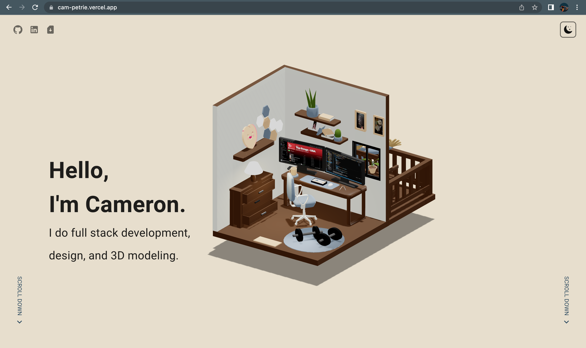
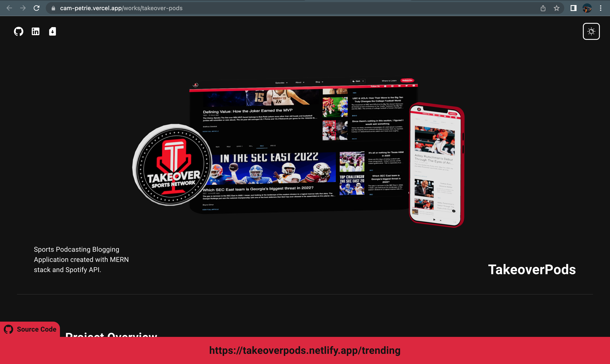

<div id="top"></div>

[![LinkedIn][linkedin-shield]][linkedin-url]
<br />

<div align="center">
    

  </div>
<h3 align="center">Cam Petrie Portfolio Website</h3>
<p align="center">NextJS Application utilizing <b>Blender</b> and <b>ThreeJS</b>. <b>MaterialUI</b> components as well as <b>GSAP</b> Scroll triggers featured as well. 
<br />
<br />
    <a href="https://github.com/Peach97/portfolioportfolio"><strong>Explore the code »</strong></a>
    <br />
    <br />
    <a href="https://github.com/Peach97/portfolio">View Demo</a>
    ·
    <a href="https://github.com/Peach97/portfolio/issues">Report Bug</a>
    ·
    <a href="https://github.com/Peach97/portfolio/pulls">Pull Requests</a>
      </p>
</div>

## About The Project

<div align="center">


</div>

### Built Using

[![React][react.js]][react-url]
[![MaterialUI][materialui.com]][materialui-url]
[![Node][node.js]][node-url]

<p align="right">(<a href="#top">Back To Top</a>)</p>

## Installation

#### Clone the repo

```sh
git clone https://github.com/Peach97/portfolio.git
```

  <br />
   
  ### Setting Up Node Server
  
  <br />
  
  #### Install NPM Packages
  
  ```sh
  npm install
  ````
  
  This will install all necessary dependencies associated with the project
  
  ```sh
  npm start
  ```
  
  This will set up the development server at `http://localhost:3000/`
  
  <p align="right">(<a href="#top">Back To Top</a>)</p>

## Contact

### Cameron Petrie

  <ul>
  <li> <a href="https://www.linkedin.com/in/cameron-petrie-4b00aa148/">LinkedIn</a></li>
  <li><b>petrie.cam@gmail.com</b></li>
  <li><a href="https://github.com/Peach97/">Github</a></li>
  </ul>

[linkedin-shield]: https://img.shields.io/badge/-LinkedIn-black.svg?style=for-the-badge&logo=linkedin&colorB=555
[linkedin-url]: linkedin.com/in/cameron-petrie-4b00aa148
[product-screenshot]: 
[react.js]: https://img.shields.io/badge/React-20232A?style=for-the-badge&logo=react&logoColor=61DAFB
[react-url]: https://reactjs.org/
[materialui.com]: https://img.shields.io/badge/MaterialUI-003060?style=for-the-badge&logo=MUI&logoColor=007FFF
[materialui-url]: https://mui.com/
[node.js]: https://img.shields.io/badge/Node.js-339933?style=for-the-badge&logo=Node.js&logoColor=FFFFFF
[node-url]: https://nodejs.org/en/
